# INTEGRANTES: 
# 1. Bellido Chambi Rony Widmer

## 📸 Capturas del proyecto
# 
### 🔹 Muestra la interfaz web de Django REST Framework con el endpoint de lista de películas y un formulario para agregar registros.
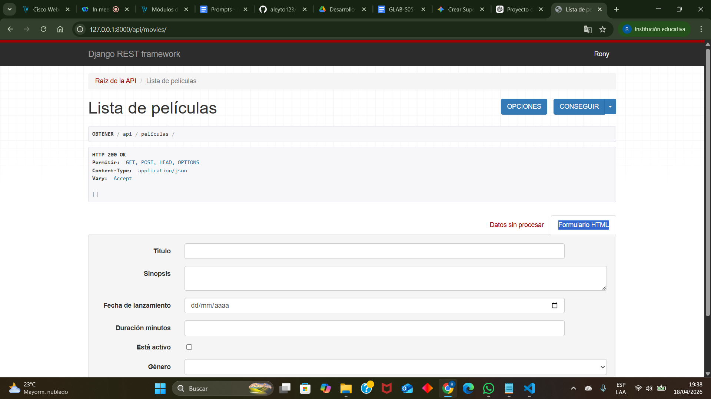

### 🔹 Vista de la raíz de la API en Django REST Framework exponiendo los endpoints de películas y géneros en formato JSON.
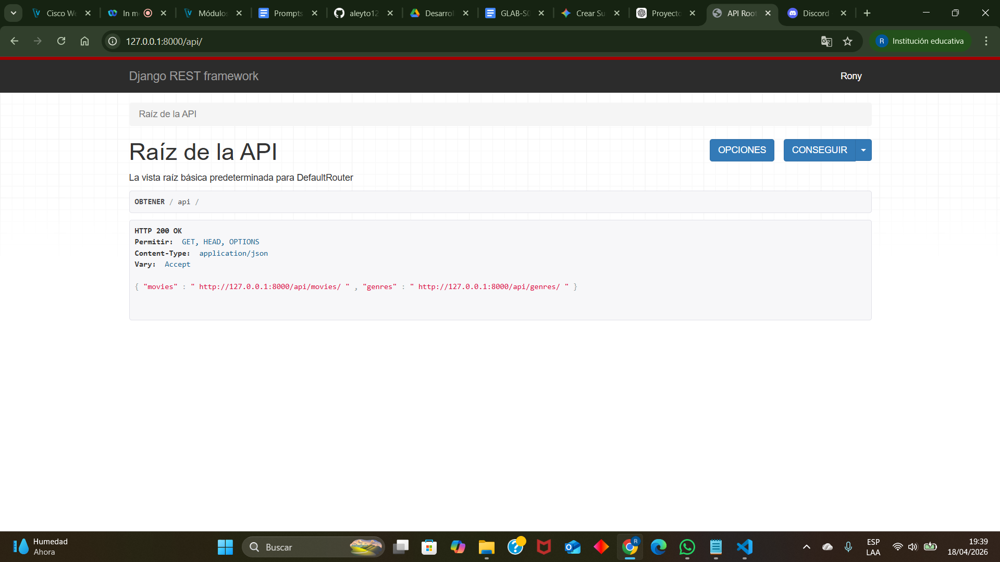

### 🔹 Vista del endpoint Movie List mostrando un listado de películas en formato JSON con detalles técnicos de la respuesta HTTP.
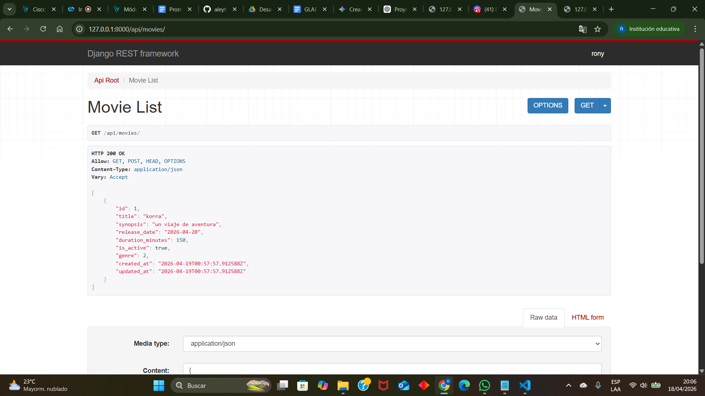

### 🔹 Visualización de la respuesta en formato JSON puro (raw data) de la lista de películas para su consumo por aplicaciones externas.
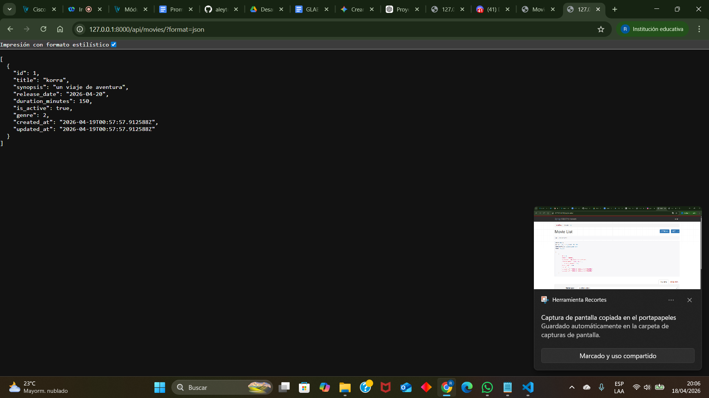

### 🔹 GET http://127.0.0.1:8000/api/movies/ :
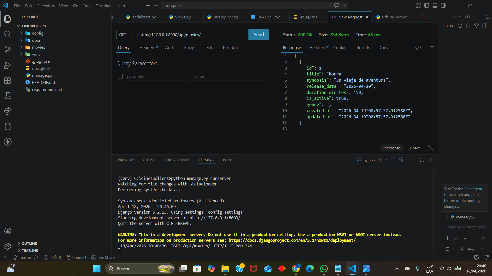

### 🔹 GET POR ID http://127.0.0.1:8000/api/movies/3/ :
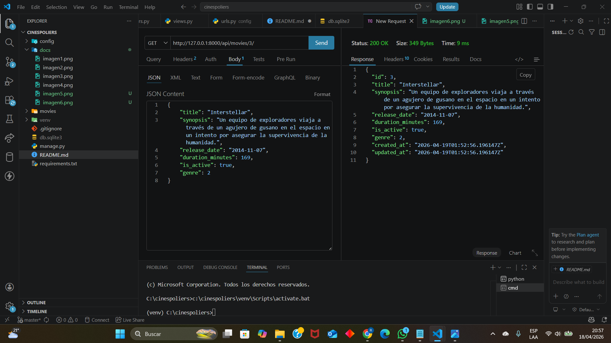

### 🔹 POST http://127.0.0.1:8000/api/movies/ :
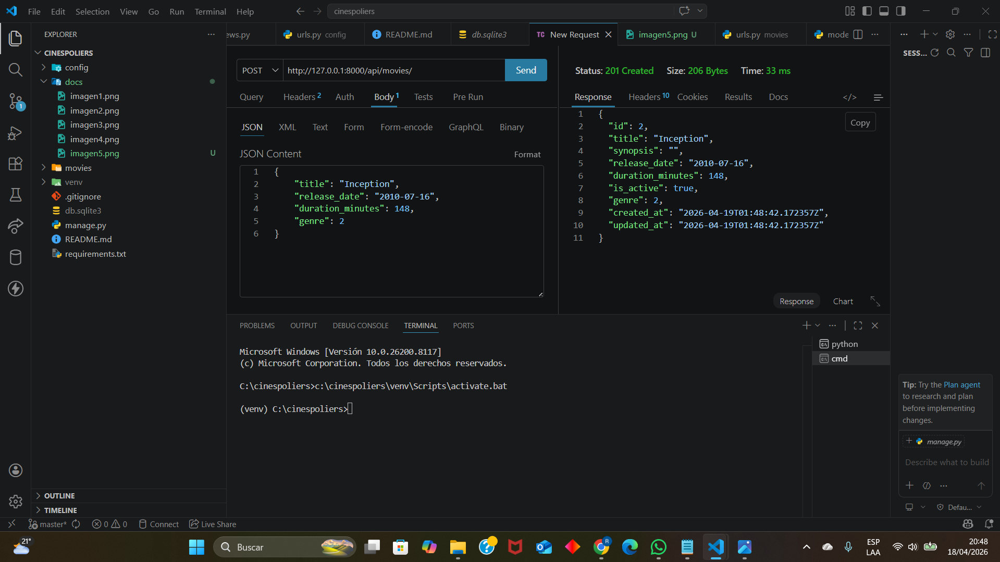

### 🔹 PUT http://127.0.0.1:8000/api/movies/3/ :
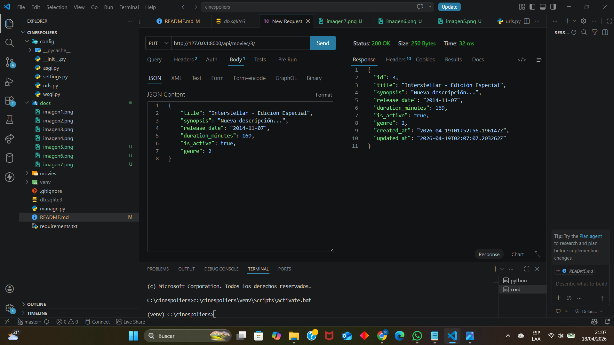

### 🔹 DELETE http://127.0.0.1:8000/api/movies/2/ :
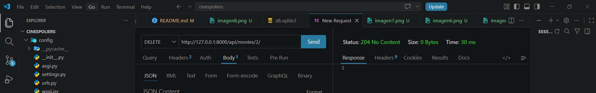
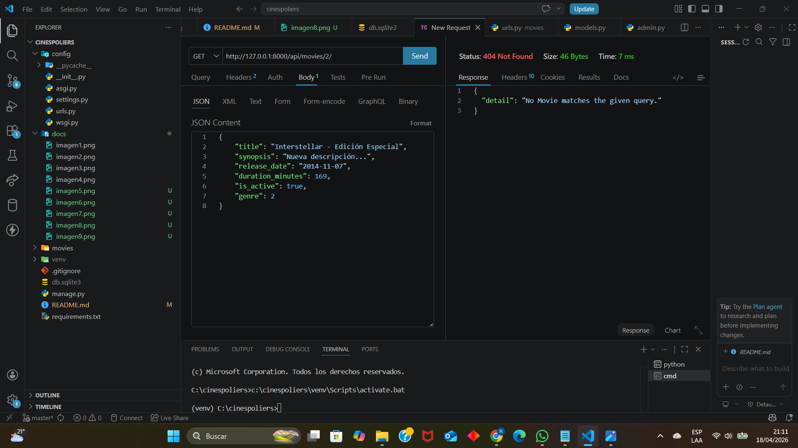
## Se puede visualizar que se elimino correctamente la pelicula con ID 2:
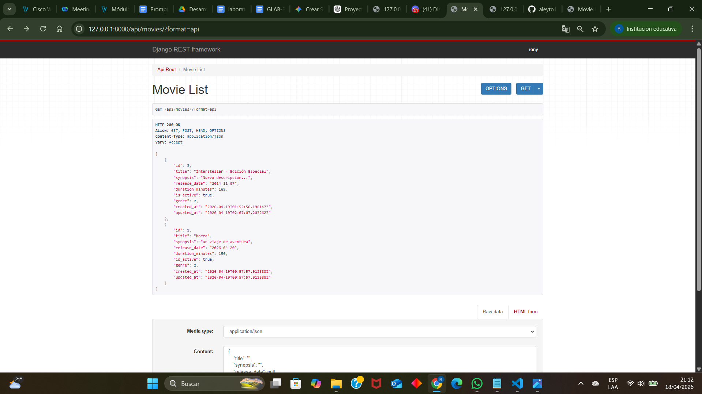

# 2. CHUCO BRAVO SHEYLA
# 3. XIOMARA garcia silva
